

# 📍 GeoTrack

### Professional Background Location Tracking for Android

Track, monitor, and analyze location history with reliable background tracking and complete privacy.

 

  

---

## ✨ Overview

GeoTrack is a professional Android application designed for reliable background location tracking. Using Android Foreground Services and Google's Fused Location Provider, GeoTrack records accurate coordinates at customizable intervals while keeping all data securely stored on your device.

Whether you're testing location-based applications, analyzing movement patterns, or collecting GPS logs, GeoTrack provides a clean and efficient solution.

---

## 📸 App Showcase

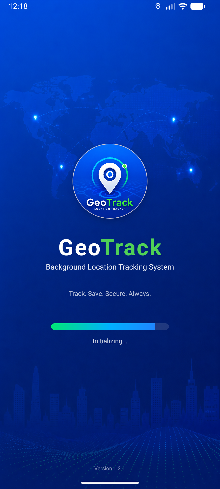
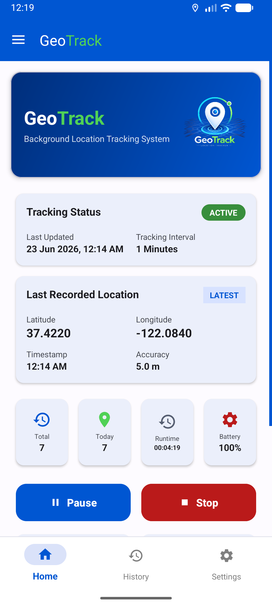
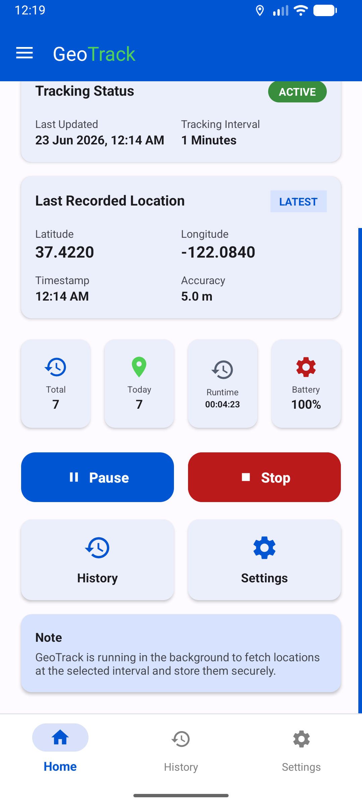

  

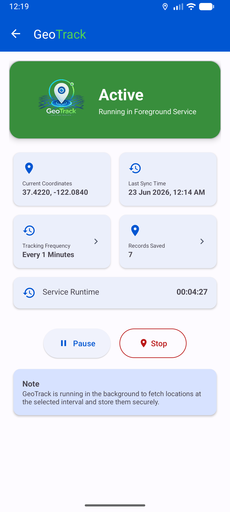
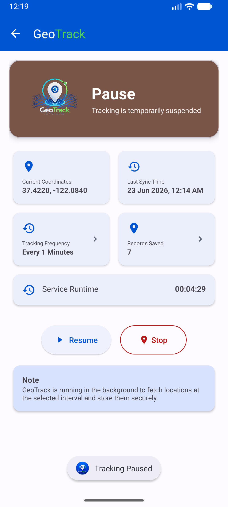
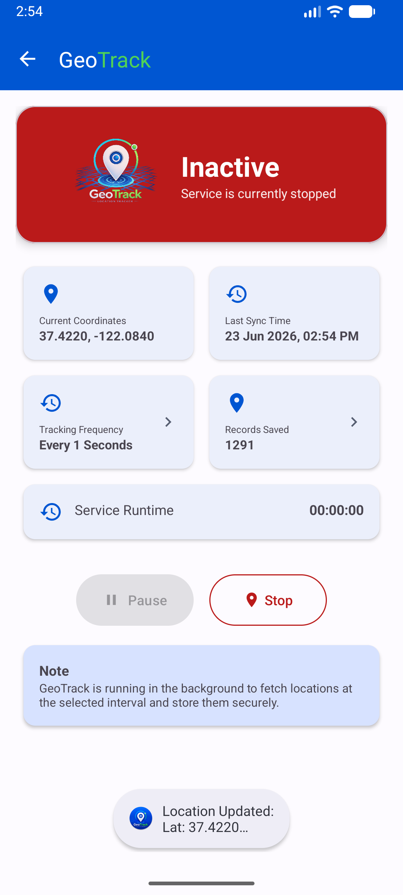

  

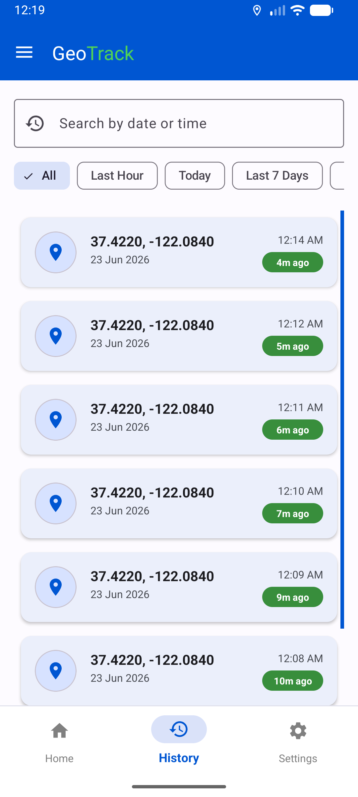
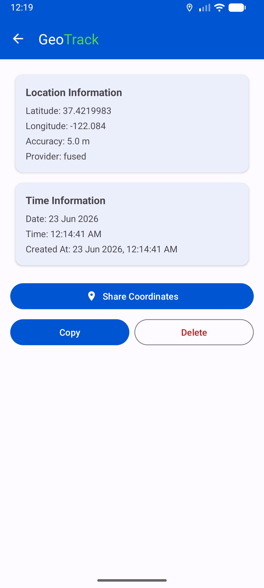
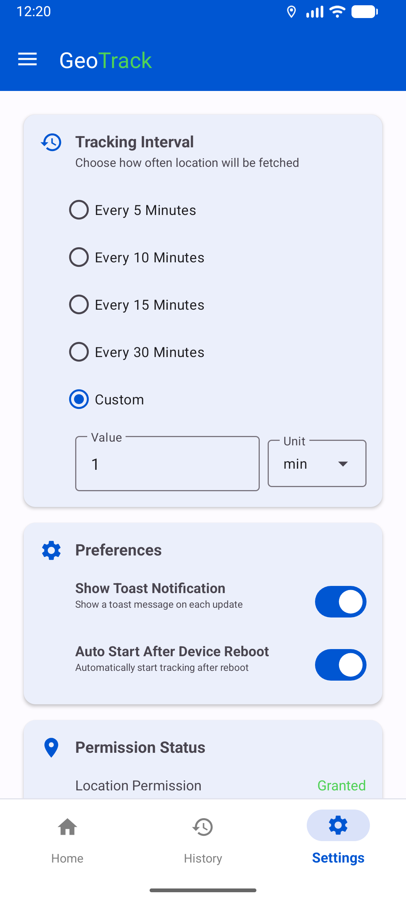

  

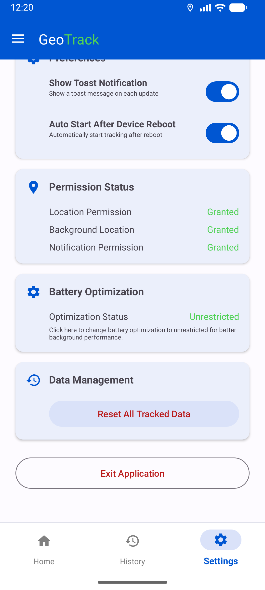
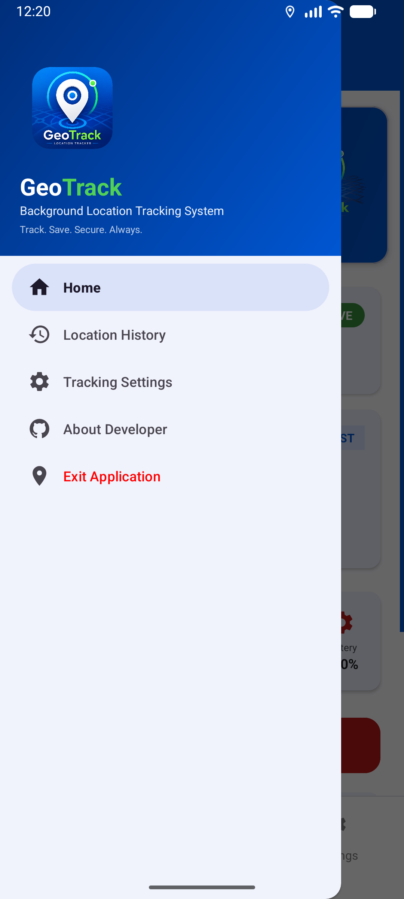
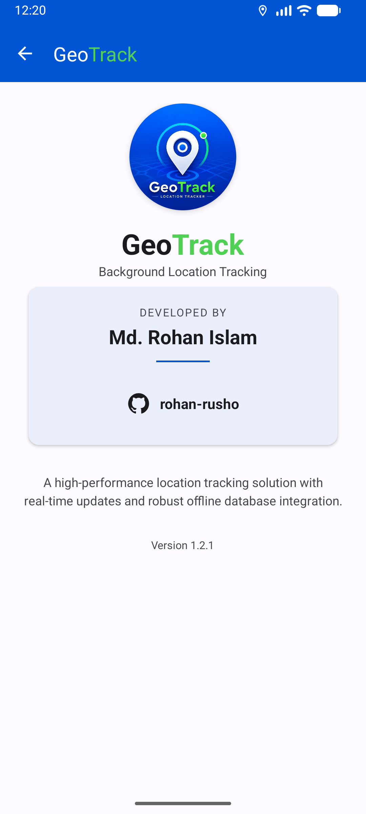

---

## 🚀 Features

### 📍 Reliable Background Tracking
Utilizes Android Foreground Services and Google's Fused Location Provider to ensure continuous tracking even when the device is locked.

### ⏱️ Customizable Tracking Intervals
Configure location updates from seconds to hours based on your requirements.

### 🗄️ Local Data Storage
Stores all tracking records locally using Room Database for fast and secure access.

### 📊 Real-Time Dashboard
Monitor service status, runtime, battery level, and total records in real time.

### 🔍 Advanced History Management
Search, filter, export, share, and manage recorded coordinates with ease.

### 🔒 Privacy First
No cloud storage, no external servers, and no third-party tracking.

---

## 🛠️ Getting Started

### 1️⃣ Install GeoTrack
Download and install the latest APK using the button above.

### 2️⃣ Grant Permissions
Allow the following permissions:

- Location Permission
- Notification Permission

### 3️⃣ Disable Battery Restrictions

For uninterrupted tracking:

Settings → Apps → GeoTrack → Battery → Unrestricted

### 4️⃣ Start Tracking

Tap **Start Tracking** to begin collecting location data in the background.

### 5️⃣ View History

Navigate to the History section to search, analyze, export, or delete saved records.

---

## ⚙️ System Requirements

- Android 7.0 (API 24) or higher
- GPS / Location Services Enabled
- Location Permission Granted

---

## 🔐 Privacy Policy

GeoTrack does not upload, share, or synchronize any data with external servers.

All location records remain securely stored on your device.

---

## 👨‍💻 Developer

**Rohan Islam**

GitHub: https://github.com/rohan-rusho

---

Made with ❤️ using Android, Java, Room Database, and Fused Location Provider

