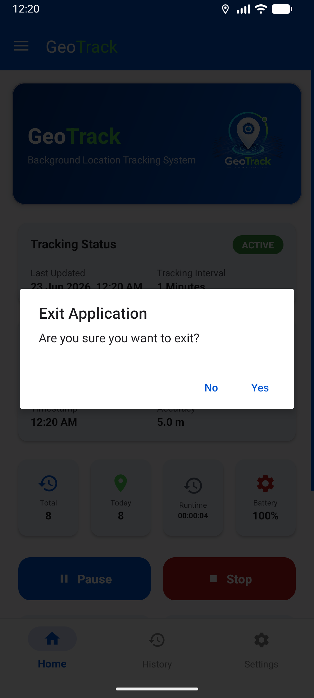

# GeoTrack 📍

GeoTrack is a professional background location tracking system for Android. It is designed to reliably capture device coordinates at specific intervals while providing a comprehensive interface to manage and analyze your movement data.

[**📥 Download GeoTrack APK**](https://github.com/rohan-rusho/GeoTrack/releases/latest)

---

## 📸 App Showcase

  
  
  
  
    
  
  
  
  
    
  
  
  
  
    
  

---

## 🚀 Key Features

- **Reliable Background Tracking**: Utilizes a Foreground Service and Google's Fused Location Provider to ensure consistent tracking even when the device is locked.
- **Customizable Intervals**: Flexible tracking options ranging from seconds to hours.
- **Data Persistence**: All records are stored locally using a Room Database.
- **Detailed History**: A complete log of your location history with search and filter capabilities.
- **Live Statistics**: Real-time dashboard showing total records, service runtime, and battery status.
- **Secure & Private**: All data remains on your device. No cloud syncing.

## 🛠️ How to Use

1. **Install the App**: Download and install the APK from the link above.
2. **Grant Permissions**: Upon first launch, the app will request Location and Notification permissions. Please allow them for proper tracking.
3. **Battery Optimization**: For best results, go to the app's settings or dashboard and set Battery Usage to **"Unrestricted"**. This prevents the system from stopping the service during deep sleep.
4. **Start Tracking**: Simply click the **Start Tracking** button. You can monitor the status from the persistent notification or the "Service Status" screen.
5. **Analyze History**: Visit the History tab to search, filter, share, or delete recorded coordinates.

## ⚙️ System Requirements

- Android 7.0 (API 24) or higher.
- GPS/Location services enabled.

---

Developed with ❤️ by [**Rohan**](https://github.com/rohan-rusho)
